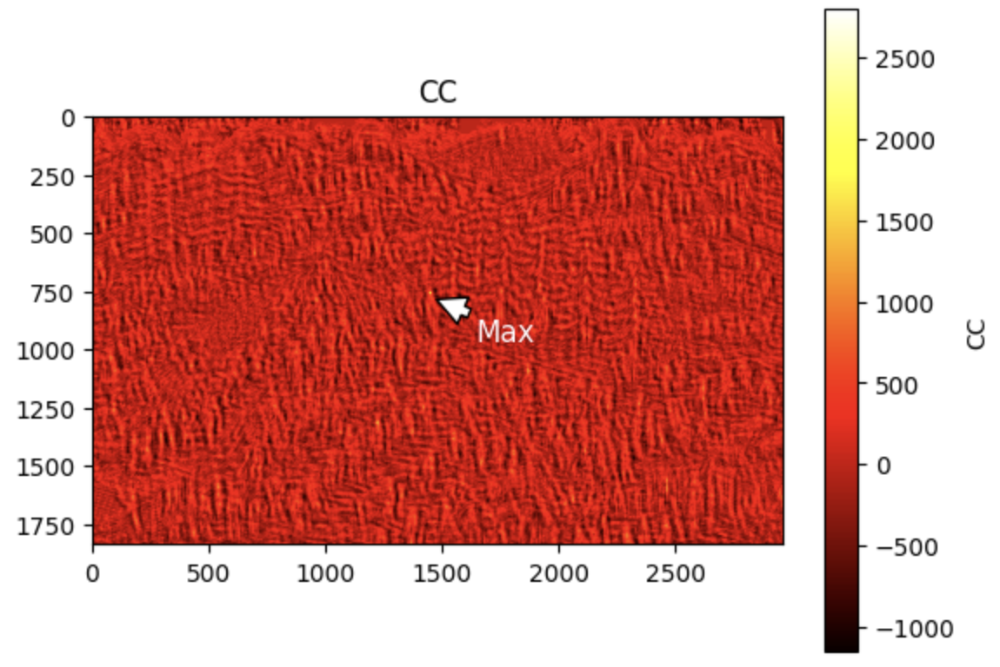

# Template-Matching

This repository walks through a pipeline for **template matching**, using OpenCV and Python. 


### 1. Target Templates

We define **two target templates** that we want to detect in more complex, cluttered images.

<p float="left">
  
  
</p>

These templates will be searched for in full-size images where they are partially hidden or surrounded by distracting elements.


### 2. Applying Template Matching

We apply OpenCV's `matchTemplate` method to compute the similarity map between the template and all possible regions in the original image.

<p float="left">
  
</p>

The heatmap shows high correlation regions as brighter spots.

---

### 3. Finding the Best Match

We identify the location of the best match using `cv2.minMaxLoc`.

```python
min_val, max_val, min_loc, max_loc = cv2.minMaxLoc(result)
```

This gives us the coordinates of the best matching window.

---

### 4. Visualizing the Matches

We draw bounding boxes around the locations where each template was detected in the cluttered background images.

<p float="left">
  
  
</p>

Each image above highlights the best match for the corresponding template, as determined by the similarity map. Despite the clutter, template matching accurately localizes the targets.


---
